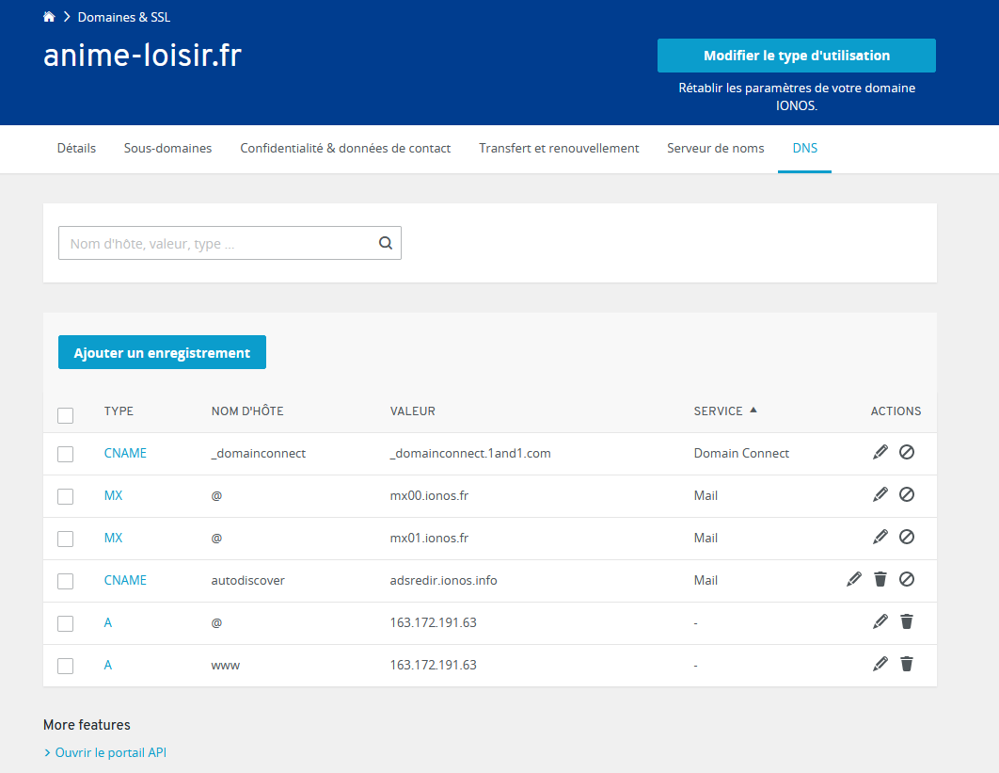

#Start

In order to display your website around the world, you should take a domain name. 

After that, you will have to link your domain name to your IP address. It's done with a registar, sometime the domain 
provider could do it. 
In the field A, type your IP address then wait about 15 minutes. 

#Vhost
<h3> Creating the website folder </h3>
After this first part, you have to config your website on your server.

First of all, create a directory name like your domain name for example in

    cd /var/www/

In this folder, copy your website repository.
You should get something like :

    /var/www/domain_name/my_website

<h3> Editing the .conf of your folder </h3>

Once your directory is created, you need to copy 000-default.conf

    sudo cp /etc/apache2/site-available/000-default.conf /etc/apache2/site-available/domain_name.conf

Then execute 

    sudo nano /etc/apache2/site-available/domain_name.conf

So configure it

Who is the admin :

    <VirtualHost *:80>
    ServerAdmin toto@email.fr

What is the server name

    ServerName domain_name.com

Path of the index.php

    DocumentRoot /var/www/html/domain_name/public    
   
At the end, you should have a .conf looking like this : 

    <VirtualHost *:80>

    # The ServerName directive sets the request scheme, hostname and port that
    # the server uses to identify itself. This is used when creating
    # redirection URLs. In the context of virtual hosts, the ServerName
    # specifies what hostname must appear in the request's Host: header to
    # match this virtual host. For the default virtual host (this file) this
    # value is not decisive as it is used as a last resort host regardless.
    # However, you must set it for any further virtual host explicitly.
    #ServerName www.example.com
    
            ServerAdmin toto@email.fr
            ServerName domain_name.fr
            DocumentRoot /var/www/html/domain_name/public   
    
    
            # Available loglevels: trace8, ..., trace1, debug, info, notice, warn,
            # error, crit, alert, emerg.
            # It is also possible to configure the loglevel for particular
            # modules, e.g.
            #LogLevel info ssl:warn
    
            ErrorLog ${APACHE_LOG_DIR}/error.log
            CustomLog ${APACHE_LOG_DIR}/access.log combined

    
            # For most configuration files from conf-available/, which are
            # enabled or disabled at a global level, it is possible to
            # include a line for only one particular virtual host. For example the
            # following line enables the CGI configuration for this host only
            # after it has been globally disabled with "a2disconf".
            #Include conf-available/serve-cgi-bin.conf

    </VirtualHost>

If laravel is used, you should manage the rewrite rules
    
    sudo a2enmode rewrite

Add this lines in your .conf file

     <Directory /var/www/html/domain_name/public>
                Options Indexes FollowSymLinks
                AllowOverride All
                Require all granted
     </Directory>

Then, restart apache 

    sudo systemctl restart apache2
